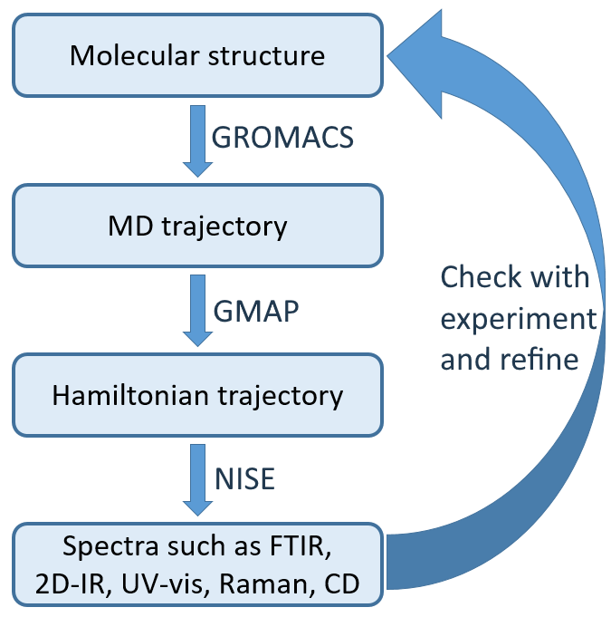
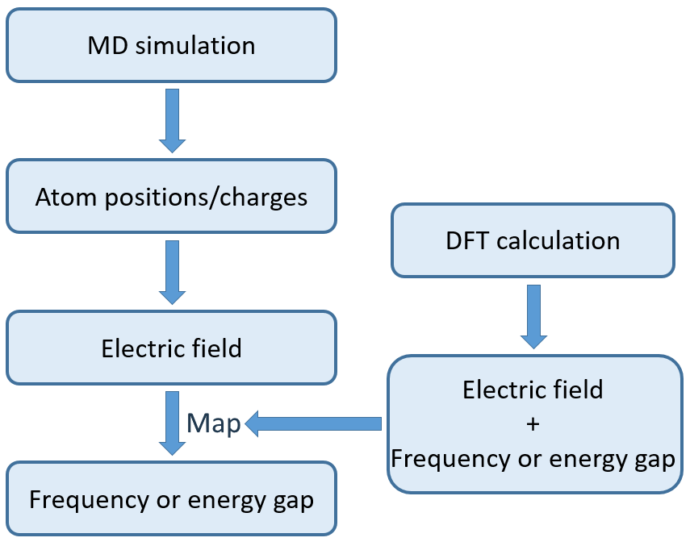

.. GMAP documentation master file, created by
   sphinx-quickstart on Thu Dec 21 15:48:35 2023.
   You can adapt this file completely to your liking, but it should at least
   contain the root `toctree` directive.

GMAP documentation
##################

.. grid:: 1 2 2 3

    .. grid-item-card::
        :margin: 0 3 0 0

        **Installation**
        ^^^^^^^^^^^^^^^^
        It would be really nice to have some instructions on how to install GMAP!

    .. grid-item-card::
        :margin: 0 3 0 0
        :link: User_guide/index
        :link-type: doc

        **User Guide**
        ^^^^^^^^^^^^^^
        It would be really nice to have a clear user guide here!
    
    .. grid-item-card::
        :margin: 0 3 0 0
        :link: Theory/index
        :link-type: doc

        **Theory**
        ^^^^^^^^^^^^^^^^^^^^^^^^^
        An overview of all the theory (and relevant publications) behind GMAP.

    .. grid-item-card::
        :margin: 0 3 0 0
        :link: Adding_a_new_map/index
        :link-type: doc

        **Customizable maps**
        ^^^^^^^^^^^^^^^^^^^^^
        Users can use community-created maps to include many different functional groups, models, and techniques.
    
    .. grid-item-card::
        :margin: 0 3 0 0
        :link: Developer_guide/index
        :link-type: doc

        **Developers guide**
        ^^^^^^^^^^^^^^^^^^^^
        Here, developers can find more in-depth information about the program.
    
    .. grid-item-card::
        :margin: 0 3 0 0
        :link: api_out/modules
        :link-type: doc

        **Code documentation**
        ^^^^^^^^^^^^^^^^^^^^^^
        A per-function level overview of the inner workings of GMAP.

.. toctree::
    :maxdepth: 4
    :hidden:

    User_guide/index
    Theory/index
    Adding_a_new_map/index
    Developer_guide/index
    api_out/modules

What does GMAP do?
==================

Gmap combines different spectroscopic tools into one convenient package. All of these tools play a role in computing a spectrum from a simple atomistic structure.

The figure on the right shows the general workflow for computing a spectrum when given a starting structure. It is basically a three-step process:

1. The first step is to create an MD trajectory from the starting structure. It can be seen as creating a movie from a single frame. It is usually performed by molecular dynamics packages like Gromacs, Amber, Charmm and NAMD. 

2. GMAP performs the second step - converting each frame of the MD trajectory into a hamiltonian, creating a hamiltonian trajectory.

3. The last step of converting the hamiltonian trajectory into a spectrum can be done by solving the schrödinger equation for the hamiltonian trajectory, for example using NISE.

Goal of AIM
-----------

Previously released as a standalone program, AIM is included here for convenience. The program can treat any functional group, as long as the map describing it does not require more than 6 atoms. This means that it is intended for (and limited to) vibrational groups, and therefore vibrational spectra, like FTIR, 2D-IR, Raman, 2D-IR-Raman, SFG and CD. While originally created for the amide-I stretch of proteins, it has evolved to also accept maps for other types of groups and different systems. 

Goal of GEM
-----------

GEM is intended to be the more generalist successor of AIM - no longer aimed specifically at proteins, no longer limited to vibrational spectroscopy.

Concept of maps
---------------

Both AIM and GEM make use of maps. A map basically encodes a relationship. Usually between one or more electrostatic properties, and a spectroscopic one. A simple example is the Tokmakoff map - it relates the strength of the electric field at a given point in a given direction to the frequency at which an amide group is expected to oscillate.

Maps allow to combine ab initio methods and advantages with that of molecular dynamics. Again using the Tokmakoff map as an example, a protein would be too large to calculate the different frequencies of using ab initio methods, but the frequencies have too much quantum nature to be treated classically. The relationship encoded in a map, luckily, does not require an entire protein, but a smaller model system that can be treated using ab initio methods. The map can then be applied to the classically-generated MD trajectory, resulting in much faster computation times, but still considering the quantum nature.

The figure on the right is a visual representation of this process. A model system is placed in many random enviroments. For each enviroment, the electrostatic potential, the electric field and/or the electric field gradient is calculated, and an ab initio calculation is applied to calculate the desired property. Then, a relation is found between (some of) the inputs and the output.

Then, the same electrostatic properties are calculated for each group in the MD system. The same relation can than be applied to find the desired property for each of the groups.

Indices and tables
==================

* :ref:`genindex`
* :ref:`modindex`
* :ref:`search`
